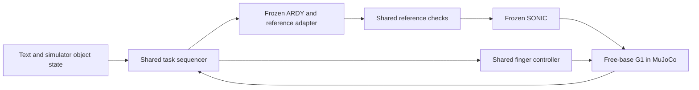
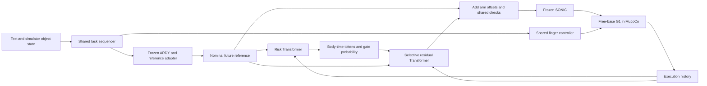

# Predictive Risk-Guided Residual Control for Text-Driven Humanoid Manipulation

HKU DASC 7606C Deep Learning · **Track 4, Group 3** · September 29–October 15, 2026

We study whether a representation of **where and when execution may fail** helps a
small residual controller improve text-driven tabletop block grasping by a
simulated Unitree G1. The instructor-approved comparison uses one frozen
text-to-motion model, the same model with our modules, and controlled ablations.
All task data and demonstrations will come from simulation.

**Selected baseline:** `ARDY-G1-RP-25FPS-Horizon8` + frozen SONIC. The learned
modules correct arm-joint references before SONIC; a shared controller drives
the fingers. Model selection reflects streaming and G1 integration needs, not
a claim that ARDY has the best grasp benchmark score.

[Proposal PDF](docs/proposal.pdf) · [LaTeX source](docs/proposal.tex) ·
[Integration guide](docs/integration.md) · [Data contract](docs/data.md) ·
[Experiment guide](docs/experiments.md)

## Current implementation

This is the first implementation milestone. **The learning pipeline runs on CPU;
the ARDY–SONIC–MuJoCo grasping system has not yet been connected or evaluated.**
There are no physical task results or pretrained project checkpoints in this repository.

| Component | Status |
| --- | --- |
| Temporal risk Transformer, body/time tokens, auxiliary heads | Implemented |
| Risk-conditioned residual Transformer, arm mask, hard bounds | Implemented |
| Separate risk/residual training, train-only normalization, checkpoint reload | Implemented |
| Parent split audit, masked labels, balanced correction/identity batches | Implemented |
| B0/B1/B2/I1–I4/P and seven ablation definitions | Implemented; no physical results |
| Selective inference, offset rate limit, reference resampling | Implemented as reusable components |
| Named G1 joint adapter and SONIC v1 binary serialization | Unit-tested; receiver integration pending |
| Paired evaluation plan, Wilson intervals, bootstrap, grasp criterion | Implemented as evaluation utilities |
| ARDY weights/text encoder, frozen SONIC inference, MuJoCo scene | Pending integration |
| Text/goal sequencer, calibrated finger control, IK recovery teacher | Pending implementation |
| Snapshot branches, physical rollout collection, live scheduling/transport | Pending integration |
| S4000 training and model throughput | Not yet tested |

## Architecture

Both systems use the same privileged simulator object state, text grounding,
standing/wrist constraints, articulated hand, reference checks and contact physics.
Camera-based perception and VLA experiments are future work.

### B0: frozen baseline



### P: predictive risk + residual



Risk inputs are approximately 360 ms of sampled execution history, eight nominal
future reference samples at 40 ms spacing, and planned phase/finger context.
The default Transformer has width 256, four layers and eight attention heads.
It produces `Z ∈ R^(8×4×32)`, tracking/contact/balance predictions and a gate score.
The four groups are left arm/hand, right arm/hand, torso and lower body.

The residual reads history, nominal references and one of the risk interfaces.
Its desired offsets are clipped to `±epsilon` and masked to the 14 arm joints.
Low risk skips residual inference and requests zero offset; a shared rate limiter
ramps any previously applied offset back to zero. Root, legs and fingers receive
no learned offsets. SONIC provides whole-body tracking and lower-body stabilization.

## Quick start: CPU pipeline

Python 3.10+ is required. The first milestone was verified with Python 3.11,
PyTorch 2.5.0 and NumPy 1.26.4 on CPU. Run from the repository root:

```bash
python3 -m venv .venv
source .venv/bin/activate
python -m pip install -e .
python -m unittest discover -s tests -v
python scripts/check_backend.py --device cpu --config configs/default.yaml
python scripts/smoke.py --out artifacts/smoke
```

Use a fresh output directory for each run. The smoke command generates a clearly
marked synthetic dataset, trains risk and B1/I2/P with a small Transformer,
reloads checkpoints, checks offline inference and creates the paired evaluation
plan. It downloads no ARDY/SONIC weights and runs no robot physics.
`replay.json` deliberately reports `physics_executed: false` and `task_success: null`.

Outputs include `risk/best.pt`, `B1/best.pt`, `I2/best.pt`, `P/best.pt`, per-run
configuration/metadata, epoch losses and offline diagnostics. Each checkpoint
records the source dataset hash, parent-split provenance through that file,
model configuration, seed, Git revision/dirty status and train-only normalizers.
Risk-conditioned residual checkpoints also record the frozen risk checkpoint hash.
Generated outputs are ignored by Git.

## Training on collected simulation data

Export nominal rollouts and validated teacher recoveries using the
[version-1 dataset contract](docs/data.md). Then:

```bash
python -m risk_residual.training.train_risk \
  --config configs/default.yaml --data datasets/windows.npz \
  --out artifacts/risk-seed0 --device cpu --seed 0

python -m risk_residual.training.train_residual \
  --config configs/default.yaml --data datasets/windows.npz \
  --experiment P --risk-checkpoint artifacts/risk-seed0/best.pt \
  --out artifacts/P-seed0 --device cpu --seed 0
```

Change the explicit device only after checking that host. On S4000, use the
cluster's matched PyTorch/`torch_musa` environment and run
`python scripts/check_backend.py --device musa --config configs/default.yaml`.
Do not replace the vendor PyTorch installation with a generic CUDA wheel.
ARDY/SONIC inference dependencies are separate from training our modules;
TensorRT support on S4000 is not assumed.

Risk training uses masked tracking MSE and contact, balance and intervention BCE.
Residual training uses **disjoint** recoverable correction and stable identity
subsets, with a fixed sampling ratio and a temporal smoothness loss. Failed
teacher recoveries train risk only. Risk weights remain frozen during residual
training; conditioning uses predictions, never future actual states or label tokens.

## Comparisons and ablations

The primary comparison is **B0 versus P**. Complete B0/B1/I2/P first.

| ID | Gate | Residual conditioning | Checkpoint rule |
| --- | --- | --- | --- |
| B0 | Off | None | No learned module |
| B1 | Always on | History + nominal reference | Train B1 |
| B2 | Current-state thresholds | History + nominal reference | Reuse B1 |
| I1 | Predictive | Zero risk slots | Reuse B1 |
| I2 | Predictive | Global probability repeated over slots | Train I2 |
| I3 | Predictive | Time-pooled body-wise auxiliary risk | Train I3 |
| I4 | Predictive | Body × future-time auxiliary predictions | Train I4 |
| P | Predictive | Learned body × time risk tokens | Train P |

Seven single-factor ablations are `pooled`, `no_future`, `no_history`, `no_aux`,
`no_gate`, `no_identity`, and `no_smooth`. All keep the same hard limits and
residual capacity. `no_gate` reuses both trained P networks. See the
[experiment guide](docs/experiments.md) for training and reuse rules.

```bash
python -m risk_residual.evaluation.plan --out artifacts/evaluation/plan.json
```

This writes a **plan**, not results: 20 paired episodes for each core condition
(nominal, grasp-target bias, action latency); B1/I2/P use three training seeds,
other configurations start with one. The full plan is 1,260 episodes; the
priority subset is 600. Thresholds and perturbation magnitudes must be calibrated
on validation episodes and frozen before testing; unresolved values are explicitly
`null` in `configs/evaluation.yaml`.

Success requires the instructed block's **lowest point** to clear the tabletop
by at least 5 cm while held continuously for 2 s, within 30 s simulated time,
without a fall or prohibited collision. Report failed trials and timeouts in the
denominator, Wilson 95% intervals, paired episode bootstrap differences and
results separately by training seed. Keep simulated task time, wall-clock latency
and real-time factor separate. Offline window metrics are not independent trials.

## Repository layout

```text
risk_residual/
  adapters/      G1 names, reference resampling, SONIC wire serialization
  models/        Risk Transformer, risk interfaces, residual Transformer
  data/          Dataset validation, parent splits, labels, synthetic fixture
  training/      Losses, training CLIs, normalization and checkpoint loading
  control/       Gates, selective inference, offset limits, offline replay
  evaluation/    Ablation definitions, paired plans and statistics
configs/         Full/smoke settings and evaluation calibration checklist
scripts/         CPU smoke, backend check, exported-motion conversion
tests/           Model, data, control, wire and evaluation contract tests
docs/            Proposal, data contract, integration and experiments
```

## Milestones and ownership

| Dates | Acceptance target |
| --- | --- |
| Sep 29–30 | Model access, S4000 operator check, frozen SONIC/G1 simulation |
| Oct 1–3 | ARDY constraints, shared hands, contact-based baseline grasp/lift, teacher recoveries |
| Oct 4–7 | Rollouts, risk/residual training, closed-loop selective correction |
| Oct 8–11 | Core comparisons first, then interfaces/loss ablations and frozen results |
| Oct 12–14 | Reproduce runs; report, slides, videos and repository release |
| Oct 15 | Final checks and submission |

| Member | Responsibility |
| --- | --- |
| Gu Wentao | Architecture, experiment design, coordination and S4000 training |
| He Yutong | ARDY text encoding, constraints and streaming inference |
| Lu Yinuo | SONIC joint/frame mapping, resampling and reference integration |
| Shi Yixin | MuJoCo G1/table/block scene, physics and reproducible resets |
| Sun Yuhan | Risk Transformer, auxiliary heads and risk validation |
| Tie Yutong | Residual policy, bounds, losses and model ablations |
| Wang Qifa | Episode recording, loaders, normalization and split audits |
| Wang Yuxiang | Perturbations, counterfactual labels and mathematical reasoning |
| Xia Fangxin | Language/phase sequencer, wrist/standing goals and IK teacher interface |
| Yin Siyuan | Paired evaluation, statistics and failure analysis |
| Zang Ziyi | Finger actuation, contacts and physical grasp/lift verification |
| Zhu Jianyu | Runtime buffering, scheduling, reproducibility and recordings |

## Future work and references

After the ARDY study, test GR00T N1.7 or π0.5 with rendered vision and the same
risk/residual principle. Each VLA needs a validated G1 action adapter and newly
trained risk/residual modules. Joint-space bounds cannot be assumed to apply to
latent actions, and zero-shot module transfer is not claimed.

1. K. Zhao *et al.*, “ARDY: Autoregressive Diffusion with Hybrid Representation for
   Interactive Human Motion Generation,” *ACM Trans. Graph.*, vol. 45, no. 4,
   Art. no. 86, 2026, doi: [10.1145/3811284](https://doi.org/10.1145/3811284).
   [Official code](https://github.com/nv-tlabs/ardy) ·
   [Selected G1 checkpoint](https://huggingface.co/nvidia/ARDY-G1-RP-25FPS-Horizon8).
2. NVIDIA GEAR, “GR00T-WholeBodyControl,” [official repository](https://github.com/NVlabs/GR00T-WholeBodyControl)
   and [SONIC streaming documentation](https://nvlabs.github.io/GR00T-WholeBodyControl/tutorials/zmq.html),
   accessed Sep. 29, 2026.
3. Google DeepMind, “MuJoCo,” [official repository](https://github.com/google-deepmind/mujoco),
   accessed Sep. 29, 2026.

The proposal contains the full research bibliography. External code, model weights
and datasets retain their upstream licenses; none are redistributed here.
