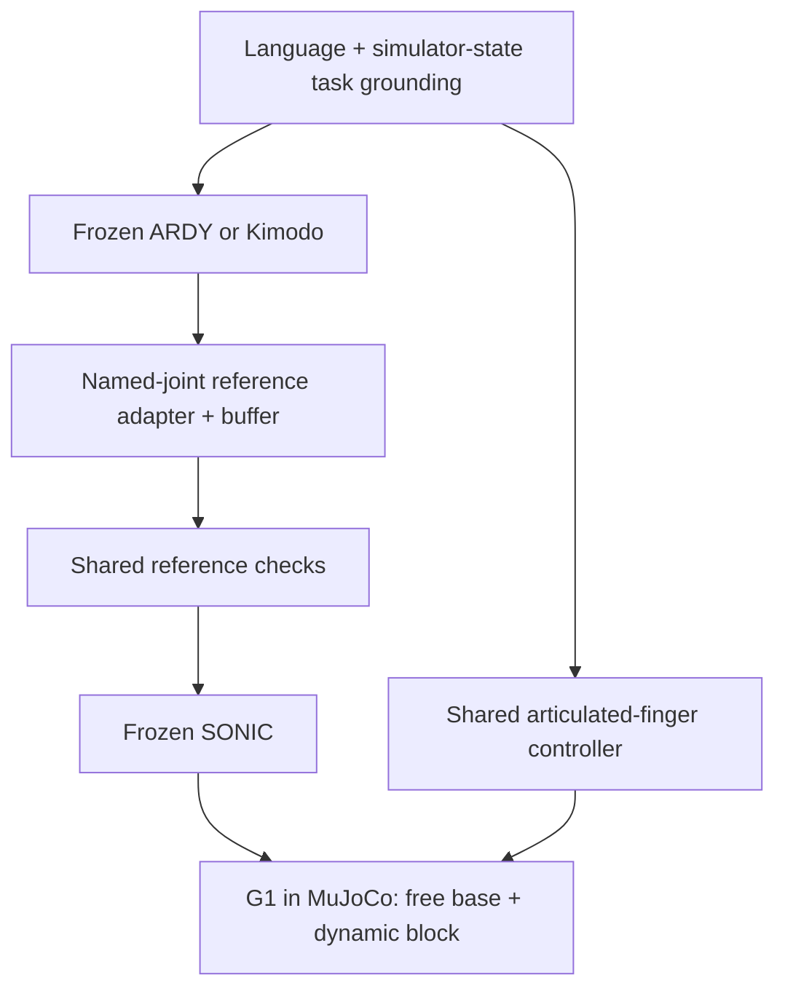
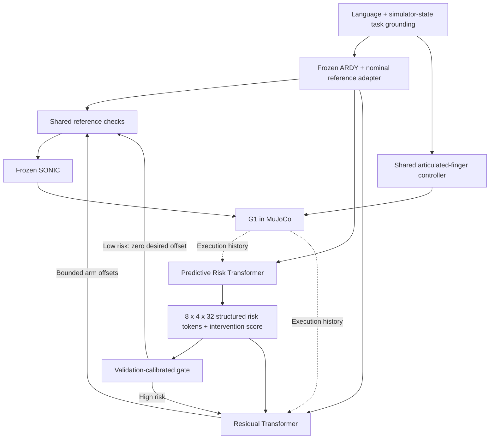

# Text-Driven Humanoid Manipulation

HKU DASC 7606C Deep Learning · Track 4, Group 3

This repository runs text-driven tabletop block grasping with a simulated
Unitree G1, frozen motion generators and frozen SONIC control. It implements
Predictive Risk and Residual models and loads them through the same execution
workflow as the nominal baseline. All task data and demonstrations are from
simulation; images are recorded outputs, and object grounding uses simulator
state.

## Start here

- [Commands](docs/commands.md): setup, `--ardy` / `--kimodo`, GPU selection,
  learned control, resume and video rendering.
- [Frozen-model integration](docs/baseline.md): assets, adapters, SONIC and
  recording interfaces.
- [Grasp task](docs/grasp.md): language grounding, contact physics and success
  criteria.
- [Learning](docs/learning.md): data collection, verified teacher pairs,
  tensor contracts, training and checkpoint provenance.
- [Measured results](docs/verification.md): dataset, model and physical trial
  evidence with limitations.
- [Submission requirements](docs/track4_requirements.md).
- [Current project context](docs/project_context.md).

The [research proposal](docs/proposal.tex) is the approved, frozen source for
research scope. Implementation status is documented separately. GR00T N1.7,
camera perception, real-robot deployment and joint fine-tuning are not
implemented in this simulation workflow.

## Motion generator and controller

Select a generator explicitly with `--ardy` or `--kimodo`. These flags are
mutually exclusive. ARDY is the compatibility default when neither is supplied.
Generator selection and learned control are separate choices:

| Execution system | Generator | Learned controller | Evidence |
| --- | --- | --- | --- |
| B0 | Frozen ARDY-G1-RP-25FPS-Horizon8 | None | Shared nominal baseline |
| K0 | Frozen Kimodo-G1-RP-v1 (`--kimodo`) | None | Exploratory second motion generator |
| P | Frozen ARDY (`--ardy`) | Frozen trained Risk + Residual + validation gate | Integrated in batch/manual execution |

P currently requires ARDY. Its checkpoints were trained on the ARDY data
interface, so Kimodo cannot be combined with these learned artifacts. Kimodo
is an additional generator comparison; it does not replace the proposal's
B0/P learned-control study or its planned controls and ablations.

## Architecture

The task sequencer combines English phase instructions with current table,
block and robot poses. The selected frozen generator produces nominal body
references. A named-joint adapter maps them into SONIC's G1 representation.
SONIC controls the 29 body joints; a separate shared controller operates the
articulated fingers.

### Nominal baseline



### Predictive Risk-guided Residual control



Risk uses 300 ms of execution history and a 280 ms nominal future. It predicts
tracking, contact, balance and intervention information. Residual reads the
predicted representation and changes only the 14 arm-reference coordinates.
Root, torso, legs and fingers remain under the common nominal system. At low
risk, residual inference is skipped and any existing offset ramps to zero.

Physics runs at 200 Hz, SONIC references at 50 Hz, and Risk/Residual updates at
10–20 Hz. Correction bounds, rate limits, physical stops, the scene and success
assessment are shared between B0 and P. This executor pauses simulation during
motion generation; it does not establish real-time deployment.

## Retained verified evidence

Risk and Residual training, validation gate selection and physical execution
through `./run.sh batch` are complete. The final dataset contains 82,060 train,
29,248 validation and 29,497 test windows. Correction supervision is much
smaller: 30, 9 and 13 samples respectively. Related branches share original
parents; window and source-entry counts are not independent trial counts.

In the fixed seed cohort 61020–61079, three batches total 60 matched B0/P trials; **both methods
succeeded in 23/60 trials (38.33%)**. P-only and B0-only successes were seven
each. This establishes working learned control but no aggregate task-success
improvement. The tuned Kimodo batch achieved 11/20 successes; its seeds and
calibration differ, so it cannot be pooled with or ranked against that B0/P
experiment. See [verification](docs/verification.md) for exact artifacts,
uncertainty and predictive-versus-reactive metrics.

## Quick start on the S4000 host

Run from the repository on the host, outside the container:

```bash
./run.sh batch --ardy --grasp --batch 20 --seed 42
./run.sh batch --kimodo --grasp --batch 20 --seed 42
./run.sh render --run output/batch-YYMMDD-HHMMSS --attempts 1 3
```

Each batch uses a fresh timestamped directory. Render only selected attempts
when raw RGB storage is limited. [Commands](docs/commands.md) includes the
matched checkpoint set for P and the offline asset-transfer procedure.

## Repository layout

```text
baseline/           Shared frozen generators, reference adapters, physics and recording
risk_residual/      Models, losses, causal dataset, provenance and inference
experiments/        Data planning, teacher collection, training and evaluation
scripts/            Host workflows, asset tools, rendering and guarded pipelines
configs/            Source/model locks, prompts and learning/data configurations
docker/             Vendor MUSA container launcher and rendering/GUI support
tests/              Contracts, regression checks and physical/rendering probes
docs/               Setup, task, learning, measured results and frozen proposal
checkpoints/        Local model assets and manifests (ignored)
third_party/        Pinned upstream checkouts (ignored)
output/             Datasets, checkpoints, trials and rendered videos (ignored)
```

Keep original model download metadata and generated evidence outside Git.
`output/` may resolve to a shared `/data` volume; the launcher mounts its target
inside the container. Source archives use an explicit packaging scope.

External code, models and datasets retain their upstream licenses. Source and
checkpoint references are pinned in `configs/baseline.lock.json` and
`configs/kimodo.lock.json`; acknowledge them and LLM assistance in course
submissions.
