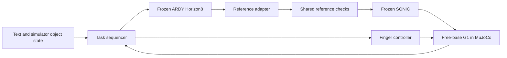
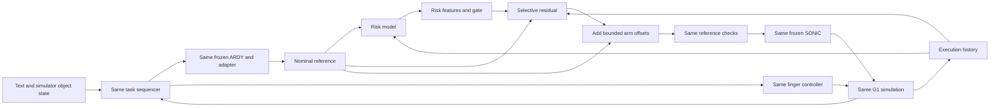

# Text-Driven Humanoid Manipulation

HKU DASC 7606C Deep Learning · Track 4, Group 3

The project compares a frozen ARDY–SONIC baseline with the same system augmented
by predictive risk and arm-reference residuals, entirely in G1 simulation.
The full research scope is described in the [proposal](docs/proposal.pdf)
([LaTeX source](docs/proposal.tex)).

**This revision contains the B0 baseline tools only.** Model downloads, ARDY
inference, reference conversion and a SONIC ONNX check are available. The
SONIC observation adapter, MuJoCo control loop and physical grasping task remain
to be connected. No grasping results are reported.

[Setup and commands](docs/baseline.md) · [Integration notes](docs/integration.md) ·
[Verification](docs/verification.md)

## Architecture

### B0: frozen baseline



B0 supplies the nominal reference directly to the shared checks. It has no risk
model, learned correction, training entry point or learned checkpoint dependency.
The diagram shows the intended closed loop; the task sequencer, finger control,
physical reference checks and simulation executor are still pending.

### P: planned Risk + Residual extension



The extension will depend on the baseline, with corrections inserted between
the reference adapter and shared checks. Only the 14 arm-joint references may
receive learned offsets. Root, leg and finger references remain unchanged.
Task grounding, hand control, limits, physics and evaluation must be shared.

Risk/Residual models, training, datasets, ablations and their configurations are
not part of this revision. They will be developed separately after the baseline
execution path is established. The baseline package must never import that
extension.

## Run on S4000

Use the matched vendor `torch`/`torch_musa` environment. The supplied Dockerfile
uses `registry.mthreads.com/mcconline/musa-pytorch-release-public:rc5.1.0-v2.9.1-S4000-py310`.
If the image already exists, enter it directly:

```bash
./docker/run-musa.sh bash
```

Otherwise, build it first:

```bash
docker build -f Dockerfile.musa -t dl-musa:latest .
```

The host needs the MUSA container toolkit registered with Docker. On a host where
the toolkit is installed, an administrator can register it with:

```bash
sudo /usr/bin/musa/docker setup /usr/bin/musa
sudo systemctl restart docker
```

Set `MUSA_IMAGE` to use another compatible image, or
`MTHREADS_VISIBLE_DEVICES=0` to select one S4000. Inside the container:

```bash
python -m venv --system-site-packages .venv-baseline-musa
source .venv-baseline-musa/bin/activate
bash scripts/install_baseline.sh
python scripts/fetch_baseline.py --only sonic
python scripts/check_sonic_onnx.py --out artifacts/sonic-cpu-01
```

Continue with ARDY and LLM2Vec downloads using the [setup guide](docs/baseline.md).
The official SONIC C++ deployment requires TensorRT/CUDA; the CPU ONNX probe
checks the frozen graphs independently before the simulation adapter is built.

## Local checks

```bash
python -m unittest discover -s tests -v
python scripts/check_backend.py --device cpu
python scripts/smoke.py --out artifacts/baseline-smoke-01
```

`check_backend.py` checks inference primitives without loading either model.
`smoke.py` checks joint ordering, resampling and SONIC packet fields with a
synthetic reference. Neither command runs training or robot physics. Use a new
output directory for each run. Check MUSA on the target machine with
`python scripts/check_backend.py --device musa`, then run the actual model checks.

## Repository layout

```text
baseline/
  common.py         Source and weight provenance
  text_encoder.py   Local Llama backbone and two frozen LLM2Vec adapters
  llama.py          Bidirectional attention compatibility
  adapters/         G1 joint order, reference resampling and SONIC packets
configs/
  baseline.lock.json
scripts/            Baseline installation, downloads, inference and checks
docker/             MUSA container launcher
tests/              Baseline provenance and packaging checks
docs/               Baseline setup, integration, verification and project proposal
```

Weights, datasets, environments, upstream checkouts and generated artifacts are
excluded from Git. `scripts/package_baseline.py` uses a baseline file allowlist
for source archives, so adding an experimental training script does not add it
to the baseline upload.

## Physical acceptance target

First demonstrate free-base standing and tracking of a known reference, followed
by ARDY standing and arm motion. Then add a table, dynamic block and articulated
hand with frictional contacts.

A successful trial must lift the instructed block's lowest point at least 5 cm
above the tabletop and hold it continuously for 2 s, within 30 s of simulated
time, without a fall or prohibited collision. Record failed trials as well as
successful ones. Preserve prompts, seeds, model and scene hashes, trajectories,
video, simulation time and wall time.

## Upstream projects

- [ARDY source](https://github.com/nv-tlabs/ardy) and
  [Horizon8 G1 checkpoint](https://huggingface.co/nvidia/ARDY-G1-RP-25FPS-Horizon8)
- [SONIC source](https://github.com/NVlabs/GR00T-WholeBodyControl) and
  [streaming protocol](https://nvlabs.github.io/GR00T-WholeBodyControl/tutorials/zmq.html)
- [MuJoCo](https://github.com/google-deepmind/mujoco)

External code, models and datasets retain their upstream licenses. The proposal
contains the research bibliography and planned comparisons.
