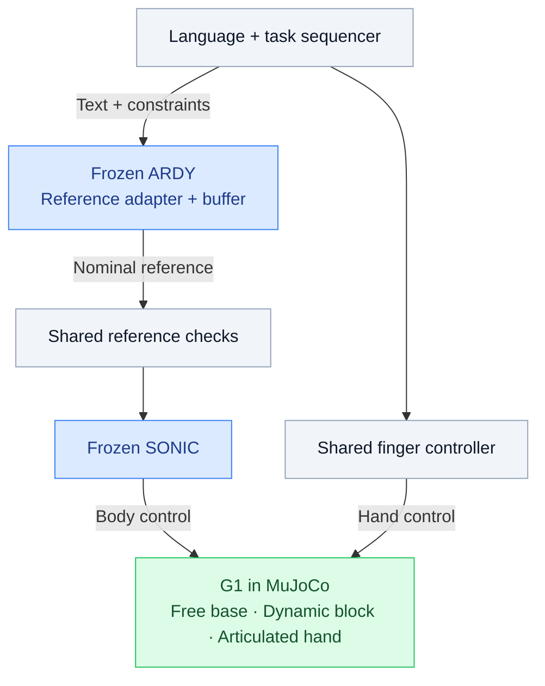
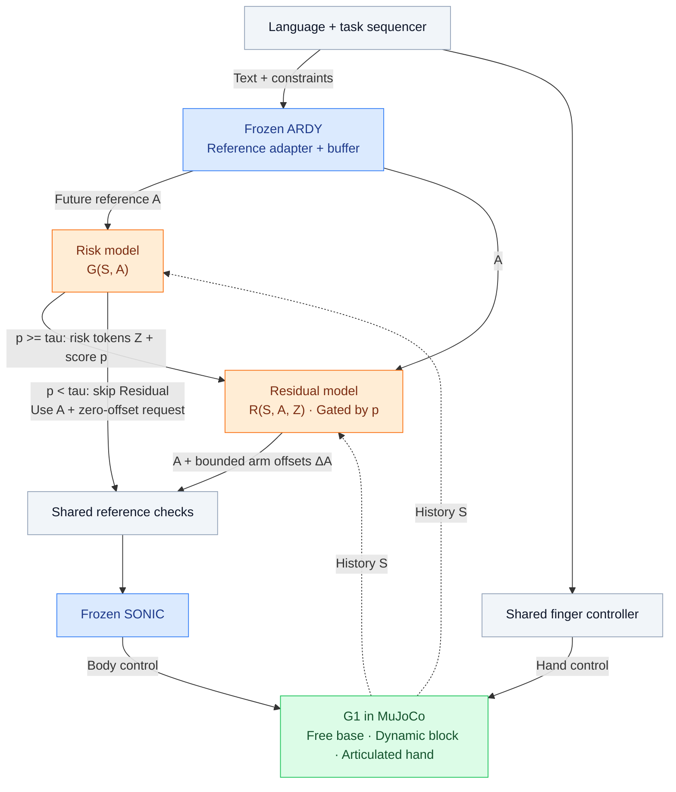

# Text-Driven Humanoid Manipulation

HKU DASC 7606C Deep Learning · Track 4, Group 3

The project compares a frozen ARDY–SONIC baseline with the same system augmented
by predictive risk and arm-reference residuals, entirely in G1 simulation.
The full research scope is described in the [proposal source](docs/proposal.tex).

[Run commands](docs/commands.md) · [Setup details](docs/baseline.md) · [Integration notes](docs/integration.md) ·
[Verification](docs/verification.md) · [B0 grasp batches](docs/grasp.md) ·
[Learning status](docs/learning.md) · [Project context](docs/project_context.md)

## Architecture

The two systems below follow the [project proposal](docs/proposal.tex). They
share text grounding, pose constraints, hand control, reference checks, frozen
ARDY and SONIC checkpoints, and the same MuJoCo scene. The diagrams describe
the intended system; implementation status is listed separately below.

A shared task sequencer turns language and simulator object poses into task
phases, wrist goals and standing constraints. ARDY receives text, constraints
and pose history. Its output is decoded, mapped into SONIC joint order and
resampled into nominal references: 29 body-joint positions and velocities,
body orientation and aligned frame indices. The study uses privileged simulator
state for grounding; camera perception is deferred.

Blue blocks contain frozen models, orange blocks are the learned Risk and
Residual models, and green is the simulator. Solid arrows carry references,
model features or control commands; dashed arrows carry execution history.
Both learned models also receive task-phase and planned hand-command context.
Shared feedback for grounding, ARDY pose history, SONIC robot
observations and feasibility checks is omitted to keep the diagrams readable.

### Baseline (B0)



B0 sends the nominal reference directly through the shared checks to SONIC.
It has no risk model or learned correction. The finger controller handles
closure, release and contact checks separately from body tracking. G1's root
remains free, and lifting must result from frictional hand contacts with a
dynamic block.

### Proposed (P): risk-guided correction



The Residual block includes arm masking, bounds and addition to the nominal
reference; rate limits and reference validation remain in the shared checks.
The low-risk branch selects the nominal reference with a zero-offset request;
it still passes through the shared checks and their rate limit.

The risk model reads 200–500 ms of execution history and future nominal motion,
with task-phase and planned finger-command context. It predicts structured
risk tokens `Z` and an intervention score `p`. The proposal uses eight future
samples at 40 ms spacing, four body groups and 32 features per token. Future
executed states are used for training labels, never as inference inputs.

When `p >= tau`, the residual model reads `(S, A, Z)` and requests bounded
arm-joint reference offsets. Only the 14 arm joints can receive learned
offsets; root, torso, legs and fingers remain outside the correction space.
At low risk, residual inference stops and requests zero correction. Any
previously applied offset ramps to zero under the same rate limit. Shared
checks enforce limits and clearance, recompute velocities and dependent fields,
and apply the same failure stops used by B0.

ARDY and SONIC stay frozen. Risk is trained first, then frozen while the
residual is trained with predicted risk features and supervised teacher
corrections. The teacher is absent at evaluation. Training uses bounded
predictions before gating; the gate controls execution at inference.

SONIC targets 50 Hz and Risk/Residual updates target 10–20 Hz. A timestamped
reference buffer covers both consumers' lookahead and resamples to their
clocks. Buffer underruns invoke a shared hold and are logged. These are target
rates, not measured real-time performance.

## Planned comparisons and ablations

The primary comparison will be **B0 versus P** under the same scene, frozen
checkpoints, task interface, hand controller and evaluation protocol. Following
the proposal, we will also run the intermediate controls and component
ablations below. These are planned experiments, not reported results.

| Experiment group | Planned comparisons |
| --- | --- |
| Residual and gating controls | B1: always-on residual; B2: reactive gate; I1: predictive gate without risk features |
| Risk representation | I2: scalar probability; I3: body-wise risks; I4: body–time risk map; P: structured learned tokens |
| Component and loss ablations | Pooled tokens; no future-action input; no execution history; no auxiliary risk losses; no selective gate; no identity loss; no smoothness loss |

B1, B2 and I1 will reuse one residual checkpoint. The no-gate variant will reuse
P's trained networks without retraining. Other variants will follow the
proposal's retraining rules, with one factor changed at a time. We will
prioritize B0, B1, I2 and P and identify any unfinished experiments explicitly.

## Current implementation

The implemented B0 path uses pinned ARDY and SONIC with a free-base MuJoCo G1.
There are two execution modes in `scripts/run.py`: `batch` generates independent
attempts; `manual` accepts one prompt JSON at a time with an optional persistent
GUI. Both preload SONIC, ARDY, and the text encoder, then display an explicit
model-ready banner before accepting or executing prompts. Both use
`baseline/execution.py`, reset per attempt and save full 50 Hz
states. Defaults have no prompt or task, only a robot and ground. `--grasp`
enables the pilot table/block scene and simulator-state grounding. By default,
the free base starts at the grounded table target before physics, passes a
two-second stable stand check, then runs reach, lower, close, lift, and hold.
Add `--walk` to start farther back and run approach, settle, and upper-body
preparation before those hand phases. `--direct-start` remains a compatibility
alias for the default start. Manipulation-only results and walk-and-grasp
results are recorded separately.
Preparation requests an 8-degree waist inclination because this G1 has a rigid
head; both feet must settle again before the arm reach. Root paths and wrist
constraints condition ARDY without camera inputs. Actual arrival and stability
are checked before reaching; SONIC G1 mode does not directly track global root
XY. Articulated fingers and physical assessment remain shared. Busy manual
sessions discard additional input until the current attempt ends.

Sessions are saved as `output/batch-TIME/attempt-00001/` or
`output/manual-TIME/attempt-00001/`, where TIME is `YYMMDD-HHMMSS` in Asia/Shanghai time, with readable TXT/Markdown summaries,
CSV results and success/failure lists. Collection never launches a renderer.
`scripts/render.py` renders selected attempts, all attempts or successes into
RGB and MP4 afterward, with progress and fresh output directories. The default
is one third-person camera at 640×480 and 25 FPS, with H.264 CRF 18 encoding; full states remain at 50 Hz.
A software GLX viewer is available over SSH-tunneled VNC for manual sessions.

The current pilot uses one task instruction with phase-specific text and simulator
state grounding. Settle, close and hold preserve checked references. A measured
hand/block alignment gate ends descent before finger closure; the shared
controller then holds measured posture through frozen SONIC. Initial arms are
parked behind the table. Default extra backoff is .45 m and final standoff .20 m.
The extra backoff applies only with `--walk`. Both hands, including palms and
fingers, may contact the table; other robot-table contacts still stop the trial.
Contact physics remains active and allowed hand-table contacts are counted.
The complete five-second hold phase is recorded even after the two-second
success threshold is reached, subject to failure stops and the 30-second timeout.
The finger controller now uses stiffness 6 Nm/rad and damping .4 Nm s/rad,
under the original joint and motor torque bounds. The shared tabletop solver
uses elliptic friction cones, Newton, impedance ratio 10 and tolerance 1e-10
to reduce soft-contact drift; friction coefficients and object mass are retained.
Threshold achievement and retention at episode end are reported separately;
a block lost after reaching the threshold is a failed trial.
The default hand remains fully open during reach/lower, closes only after
measured alignment, then uses a 4.8-second generated lift. The calibration
protocol and evidence format are recorded in [verification.md](docs/verification.md).
The acquisition gate requires the block center within one-third of its
half-height of the measured hand center (1 cm for the 6 cm block). The October
5 three-seed, ten-second-hold repair pilot retained one success; grasp stability
remains under calibration. Create fresh collection plans after this source
change; saved plans retain their original source hashes.
These are nominal rules shared by all future methods, not learned corrections.

The Risk/Residual model, dataset checks and synthetic training pipeline are
implemented in separate packages, with an optional correction interface in
the shared simulator. A rollout-to-window converter and controlled paired
teacher pilot have been added. One pilot pair passed physical/controller-state
matching and a single-parent window audit. Split planning, batch indexing,
resumable controlled pair collection and dataset supervision audits are now
available; see [the data workflow](docs/learning.md#batch-data-workflow).
The completed October collection now supplies audited train/validation/test
Risk windows and a launcher for independent training seeds on separate MUSA
GPUs. Residual still lacks verified correction samples. General teacher
recovery and the P trial entry point remain unfinished; no measured P grasp
result is claimed.
See [learning.md](docs/learning.md) for exact scope. Experimental results and
verification gaps are maintained in [verification.md](docs/verification.md).

The baseline setup and inference scripts run independently of learning code.
Learned corrections, training and data tooling belong in separate modules that
can reuse the baseline; `baseline/` must not depend on them.

## Run on S4000

Run all host-side workflows through [commands.md](docs/commands.md), which uses
the single `./run.sh` entry point for setup, checks, execution, camera rendering,
interactive prompts, conversion and packaging. This selects the rendering image
and the existing environment while preserving the vendor `torch`/`torch_musa`
pair. See [baseline.md](docs/baseline.md) for dependency, asset and model details.

```bash
./run.sh batch --grasp --batch 20 --seed 42
./run.sh render --run output/batch-TIME --attempts 1 3
./run.sh manual --grasp --gui
```

Omit `--batch` for one attempt, and omit `--grasp` for an empty task. Replace
`batch-TIME` with the actual directory printed by the command.

## Local checks

Use `./run.sh check`, `./run.sh tests` and `./run.sh smoke --out
output/smoke-01`; the [command guide](docs/commands.md) documents these
checks and what each one establishes. Smoke data and operator tests do not
prove model compatibility or physical grasp success.

## Repository layout

```text
baseline/
  common.py         Source and weight provenance
  text_encoder.py   Local Llama backbone and two frozen LLM2Vec adapters
  llama.py          Bidirectional attention compatibility
  adapters/         G1 joint order, reference resampling and SONIC packets
  grasp.py          Pilot task grounding, spatial goals and physical assessment
  execution.py      Shared batch/manual frozen-model execution
  session.py        Immutable plans, resume and readable episode statistics
  console.py        Manual READY/BUSY input handling
  rollout.py        Complete simulation-state and compiled-scene recording
  rendering.py      Offline MuJoCo camera RGB and MP4 rendering
configs/
  baseline.lock.json
  learning/p.json   Initial Risk/Residual training configuration
experiments/        Synthetic check, training, calibration and statistics
risk_residual/      Models, audited dataset, inference and checkpoints
scripts/            Baseline installation, downloads, inference and checks
docker/             MUSA container launcher
tests/              Baseline provenance and packaging checks
docs/               Baseline setup, integration, verification and project proposal
checkpoints/baseline/ Local frozen model files and manifests (ignored)
third_party/        Pinned upstream source checkouts (ignored)
output/             Batch/manual sessions, verification and source archives (ignored)
```

Weights, datasets, environments, upstream checkouts and generated artifacts are
excluded from Git. `scripts/package_baseline.py` uses a baseline file allowlist
for source archives, so adding an experimental training script does not add it
to the baseline upload.

Keep model assets in `checkpoints/baseline/` with their original download
metadata. Generated outputs stay under `output/`; historical run outputs and
redundant installer archives were removed during the documented cleanup.

## Physical acceptance target

Validation proceeds through free-base standing and known-reference tracking,
ARDY standing and arm motion, then the pilot table, dynamic block and articulated
hand with frictional contacts. The new collector needs physical grasp/lift
acceptance before its settings become the frozen comparison configuration.

A successful trial must lift the instructed block's lowest point at least 5 cm
above the tabletop and hold it continuously for 2 s, within 30 s of simulated
time, without a fall or prohibited collision. Record failed trials as well as
successful ones. Preserve prompts, seeds, model and scene hashes, trajectories,
video, simulation time and wall time.

## Upstream projects

- [ARDY source](https://github.com/nv-tlabs/ardy) and
  [Horizon8 G1 checkpoint](https://huggingface.co/nvidia/ARDY-G1-RP-25FPS-Horizon8)
- [SONIC source](https://github.com/NVlabs/GR00T-WholeBodyControl) and
  [streaming protocol](https://nvlabs.github.io/GR00T-WholeBodyControl/tutorials/zmq.html)
- [MuJoCo](https://github.com/google-deepmind/mujoco)

External code, models and datasets retain their upstream licenses. The proposal
contains the research bibliography and planned comparisons.
