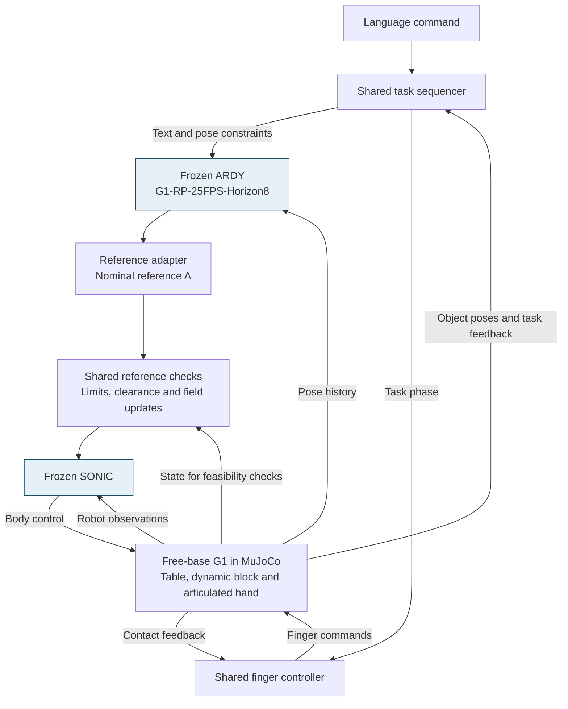
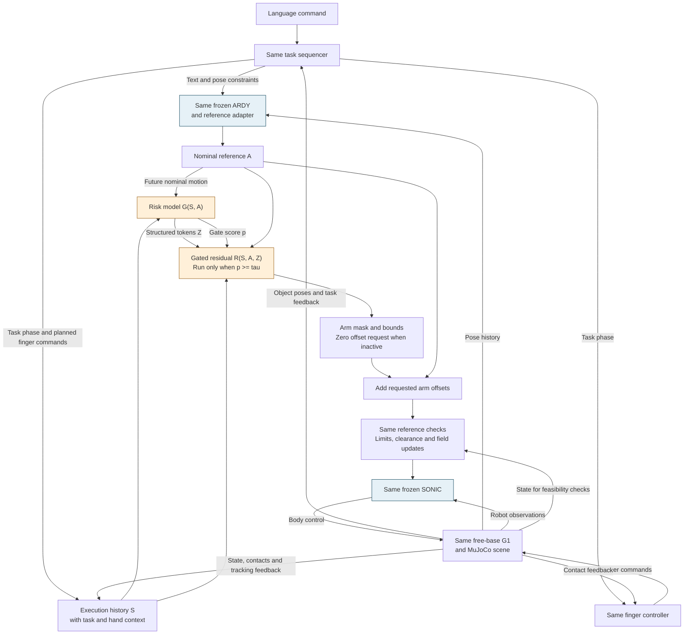

# Text-Driven Humanoid Manipulation

HKU DASC 7606C Deep Learning · Track 4, Group 3

The project compares a frozen ARDY–SONIC baseline with the same system augmented
by predictive risk and arm-reference residuals, entirely in G1 simulation.
The full research scope is described in the [proposal](docs/proposal.pdf)
([LaTeX source](docs/proposal.tex)).

[Setup and commands](docs/baseline.md) · [Integration notes](docs/integration.md) ·
[Verification](docs/verification.md)

## Architecture

The two systems below follow the [project proposal](docs/proposal.tex). They
share text grounding, pose constraints, hand control, reference checks, frozen
ARDY and SONIC checkpoints, and the same MuJoCo scene. The diagrams describe
the intended system; implementation status is listed separately below.

A shared task sequencer turns language and simulator object poses into task
phases, wrist goals and standing constraints. ARDY receives text, constraints
and pose history. Its output is decoded, mapped into SONIC joint order and
resampled into nominal references: 29 body-joint positions and velocities,
body orientation and aligned frame indices. The study uses privileged simulator
state for grounding; camera perception is deferred.

### Baseline architecture



B0 sends the nominal reference directly through the shared checks to SONIC.
It has no risk model or learned correction. The finger controller handles
closure, release and contact checks separately from body tracking. G1's root
remains free, and lifting must result from frictional hand contacts with a
dynamic block.

### Architecture with risk-guided residual correction



The risk model reads 200–500 ms of execution history and future nominal motion,
with task-phase and planned finger-command context. It predicts structured
risk tokens `Z` and an intervention score `p`. The proposal uses eight future
samples at 40 ms spacing, four body groups and 32 features per token. Future
executed states are used for training labels, never as inference inputs.

When `p >= tau`, the residual model reads `(S, A, Z)` and requests bounded
arm-joint reference offsets. Only the 14 arm joints can receive learned
offsets; root, torso, legs and fingers remain outside the correction space.
At low risk, residual inference stops and requests zero correction. Any
previously applied offset ramps to zero under the same rate limit. Shared
checks enforce limits and clearance, recompute velocities and dependent fields,
and apply the same failure stops used by B0.

ARDY and SONIC stay frozen. Risk is trained first, then frozen while the
residual is trained with predicted risk features and supervised teacher
corrections. The teacher is absent at evaluation. Training uses bounded
predictions before gating; the gate controls execution at inference.

SONIC targets 50 Hz and Risk/Residual updates target 10–20 Hz. A timestamped
reference buffer covers both consumers' lookahead and resamples to their
clocks. Buffer underruns invoke a shared hold and are logged. These are target
rates, not measured real-time performance.

## Planned comparisons and ablations

The primary comparison will be **B0 versus P** under the same scene, frozen
checkpoints, task interface, hand controller and evaluation protocol. Following
the proposal, we will also run the intermediate controls and component
ablations below. These are planned experiments, not reported results.

| Experiment group | Planned comparisons |
| --- | --- |
| Residual and gating controls | B1: always-on residual; B2: reactive gate; I1: predictive gate without risk features |
| Risk representation | I2: scalar probability; I3: body-wise risks; I4: body–time risk map; P: structured learned tokens |
| Component and loss ablations | Pooled tokens; no future-action input; no execution history; no auxiliary risk losses; no selective gate; no identity loss; no smoothness loss |

B1, B2 and I1 will reuse one residual checkpoint. The no-gate variant will reuse
P's trained networks without retraining. Other variants will follow the
proposal's retraining rules, with one factor changed at a time. We will
prioritize B0, B1, I2 and P and identify any unfinished experiments explicitly.

## Current implementation

The repository currently provides the B0 setup and inference tools: pinned
model downloads, local LLM2Vec loading, ARDY motion generation, reference
conversion and frozen SONIC ONNX probes. The SONIC observation adapter, MuJoCo
control loop, task sequencer, physical reference checks and grasping task remain
to be connected. Risk/Residual learning is planned; no physical grasping
results are reported. See [verification.md](docs/verification.md) for the checks
that have actually been run and their limits.

The baseline package is independently runnable. Learned corrections, training
and data tooling belong in separate modules that can reuse the baseline;
`baseline/` must not depend on them.

## Run on S4000

Use the matched vendor `torch`/`torch_musa` environment. The supplied Dockerfile
uses `registry.mthreads.com/mcconline/musa-pytorch-release-public:rc5.1.0-v2.9.1-S4000-py310`.
If the image already exists, enter it directly:

```bash
./docker/run-musa.sh bash
```

Otherwise, build it first:

```bash
docker build -f Dockerfile.musa -t dl-musa:latest .
```

The host needs the MUSA container toolkit registered with Docker. On a host where
the toolkit is installed, an administrator can register it with:

```bash
sudo /usr/bin/musa/docker setup /usr/bin/musa
sudo systemctl restart docker
```

Set `MUSA_IMAGE` to use another compatible image, or
`MTHREADS_VISIBLE_DEVICES=0` to select one S4000. Inside the container:

```bash
python -m venv --system-site-packages .venv-baseline-musa
source .venv-baseline-musa/bin/activate
bash scripts/install_baseline.sh
python scripts/fetch_baseline.py --only sonic
python scripts/check_sonic_onnx.py --out artifacts/sonic-cpu-01
```

Continue with ARDY and LLM2Vec downloads using the [setup guide](docs/baseline.md).
The official SONIC C++ deployment requires TensorRT/CUDA; the CPU ONNX probe
checks the frozen graphs independently before the simulation adapter is built.

## Local checks

```bash
python -m unittest discover -s tests -v
python scripts/check_backend.py --device cpu
python scripts/smoke.py --out artifacts/baseline-smoke-01
```

`check_backend.py` checks inference primitives without loading either model.
`smoke.py` checks joint ordering, resampling and SONIC packet fields with a
synthetic reference. Neither command runs training or robot physics. Use a new
output directory for each run. Check MUSA on the target machine with
`python scripts/check_backend.py --device musa`, then run the actual model checks.

## Repository layout

```text
baseline/
  common.py         Source and weight provenance
  text_encoder.py   Local Llama backbone and two frozen LLM2Vec adapters
  llama.py          Bidirectional attention compatibility
  adapters/         G1 joint order, reference resampling and SONIC packets
configs/
  baseline.lock.json
scripts/            Baseline installation, downloads, inference and checks
docker/             MUSA container launcher
tests/              Baseline provenance and packaging checks
docs/               Baseline setup, integration, verification and project proposal
```

Weights, datasets, environments, upstream checkouts and generated artifacts are
excluded from Git. `scripts/package_baseline.py` uses a baseline file allowlist
for source archives, so adding an experimental training script does not add it
to the baseline upload.

## Physical acceptance target

First demonstrate free-base standing and tracking of a known reference, followed
by ARDY standing and arm motion. Then add a table, dynamic block and articulated
hand with frictional contacts.

A successful trial must lift the instructed block's lowest point at least 5 cm
above the tabletop and hold it continuously for 2 s, within 30 s of simulated
time, without a fall or prohibited collision. Record failed trials as well as
successful ones. Preserve prompts, seeds, model and scene hashes, trajectories,
video, simulation time and wall time.

## Upstream projects

- [ARDY source](https://github.com/nv-tlabs/ardy) and
  [Horizon8 G1 checkpoint](https://huggingface.co/nvidia/ARDY-G1-RP-25FPS-Horizon8)
- [SONIC source](https://github.com/NVlabs/GR00T-WholeBodyControl) and
  [streaming protocol](https://nvlabs.github.io/GR00T-WholeBodyControl/tutorials/zmq.html)
- [MuJoCo](https://github.com/google-deepmind/mujoco)

External code, models and datasets retain their upstream licenses. The proposal
contains the research bibliography and planned comparisons.
